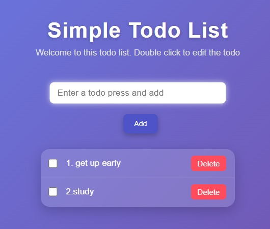

# To-Do List

A simple To-Do List application built using HTML, CSS, and JavaScript. This project helps users add, complete, and delete daily tasks through an easy-to-use interface.

## Features

- Add new tasks
- Mark tasks as completed
- Delete tasks
- Responsive design

## Technologies Used

- HTML
- CSS
- JavaScript

## Preview

## Author

Saurav Zinjan
